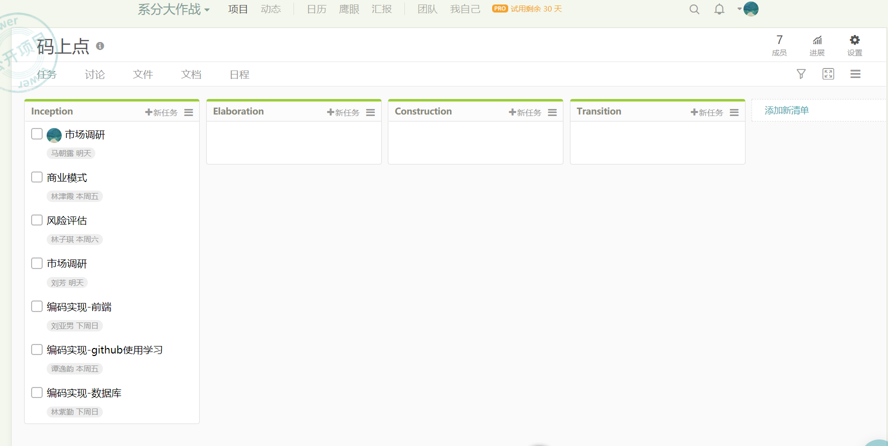

## 一、简单题
### 1.简述瀑布模型、增量模型、螺旋模型（含原型方法）的优缺点。
 （1）瀑布模型：
 
   **优点：** 为项目提供了按阶段划分的检查点，当前一阶段完成后，您只需要关注后续阶段；降低软件开发的复杂程度，提高软件开发过程的透明性和可管理性。
   
   **缺点：** 强调过程活动的线性顺序；缺乏灵活性；风险控制能力较弱；瀑布模型中的软件活动是文档驱动的，当阶段之间规定过多的文档时，会极大的增加系统的工作量；在项目各个阶段之间很少有反馈；只有在项目生命周期的后期才能看到结果；

 （2）增量模型：
 
   **优点：** 第一个可交付版本所需要的成本和时间是较少的，从而可减少开发由增量表示的小系统承担的风险；由于很快发布第一个版本，因此可以减少用户需求的变更；允许增量投资，即在项目开始时可以仅对一个或两个增量投资；人员分配灵活，提高系统的稳定性和可维护性；
   
   **缺点：** 如果没有对用户的变更要求进行规划，那么产生的初始增量可能会造成后来增量的不稳定；如果需求不像早期思考的那样稳定和完整，那么一些增量就可能需要重新开发，重新发布；由于进度和配置的复杂性，可能会增大管理成本，超出组织的能力；增量粒度难以选择；确定所有的基本业务服务比较困难。
   
 （3）螺旋模型（含原型方法）：
 
   **优点：** 设计上的灵活性,可以在项目的各个阶段进行变更；以小的分段来构建大型系统,使成本计算变得简单容易；客户始终参与每个阶段的开发,保证了项目不偏离正确方向以及项目的可控性；随着项目推进,客户始终掌握项目的最新信息 , 从而他或她能够和管理层有效地交互。
   
   **缺点：** 采用螺旋模型需要具有相当丰富的风险评估经验和专门知识，在风险较大的项目开发中，如果未能够及时标识风险，势必造成重大损失；过多的迭代次数会增加开发成本，延迟提交时间。
### 2.简述 UP 的三大特点，其中哪些内容体现了用户驱动的开发，哪些内容体现风险驱动的开发？
**三大特点：**
- 用例驱动（用户驱动）
- 以架构为中心 （风险驱动）
- 受控的迭代式增量开发 （用户驱动）
### 3.UP 四个阶段的划分准则是什么？关键的里程碑是什么？
- 初始阶段：大体上的构想、业务案例、范围和模糊评估。 （生命周期目标里程碑）
- 细化阶段：已精化的构想、核心架构的迭代实现、高风险的解决、确定大多数需求和范围以及进行更为实际的评估。（生命周期体系结构里程碑）
- 架构阶段：对遗留下来的风险较低和比较简单的元素进行迭代实现，准备部署。（初始运行能力里程碑）
- 移交：进行beta测试和部署。（产品发布里程碑）
### 4.IT 项目管理中，“工期、质量、范围/内容”三个元素中，在合同固定条件下，为什么说“范围/内容”是项目团队是易于控制的？

因为在合同固定的条件下，工期是被合同双方规定好的，而关于质量，也在合同被双方约定好，确定了验收时的条件，不容更改。而只有范围/内容是可以有项目团队进行实时控制的。

### 5.为什么说，UP为企业按固定节奏生产、固定周期发布软件产品提供了依据？

在UP中，软件开发生命周期根据时间和UP的核心工作流程划分为二维空间。时间维度从组织管理的角度描述整个软件开发的生命周期，是UP的动态组成部分，可以进一步描述为周期、阶段、迭代。核心工作流程维度从技术角度描述UP的静态组成部分。UP的生命周期在时间上被分为四个顺序的阶段，初始、细化、架构、产品交付。每个阶段结束于一个主要的里程碑，并在阶段结尾执行一次评估以确定这个阶段的目标是否已经满足。UP是一种融合了喷泉模型和增量模型的综合生命周期模型。每一次迭代就是为了完成一定阶段性小目标而从事的一系列开发活动。每一次迭代都包括需求、设计、实施、部署和测试，因此，每一个中间产品都得到了集成测试，每一个阶段结束时严格的质量评审保证了里程碑文档的质量。

## 二、项目管理使用
使用截图工具（png格式输出），展现你团队的任务Kanban，请注意以下要求：

- 每个人的任务是明确的。即一周后可以看到具体成果
- 每个人的任务是1-2项。
- 至少包含一个团队活动任务

